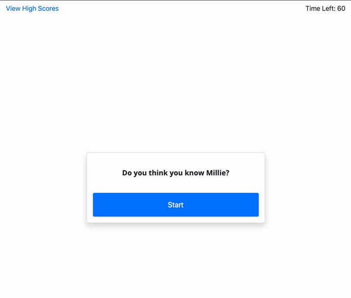

# 04 Web APIs: Millie Quiz

This is an app that has multiple-choice questions and interactive challenges. It is a timed quiz with multiple-choice questions. This app will run in the browser and feature dynamically updated HTML and CSS powered by JavaScript code. It will also feature a clean and polished user interface and be responsive, ensuring that it adapts to multiple screen sizes.

This project has been completed, but can use some touching up and debugging. This project is responsive and can be viewed on mobile, tablet, or desktop [here](https://kelly70ve.github.io/MillieQuiz/).

Enjoy!

--- 

## Project Goals

- click the start button & a timer starts and the user is presented with a question
- when the user answers a question
- they are presented with another question
- when the user answers a question incorrectly then 20 seconds of time is subtracted from the clock
- when all questions are answered or the timer reaches 0 then the game is over
- when the game is over
- then I can save my initials and score

--- 
## Project Preview

- - -
© 2019 Trilogy Education Services, a 2U, Inc. brand. All Rights Reserved.
